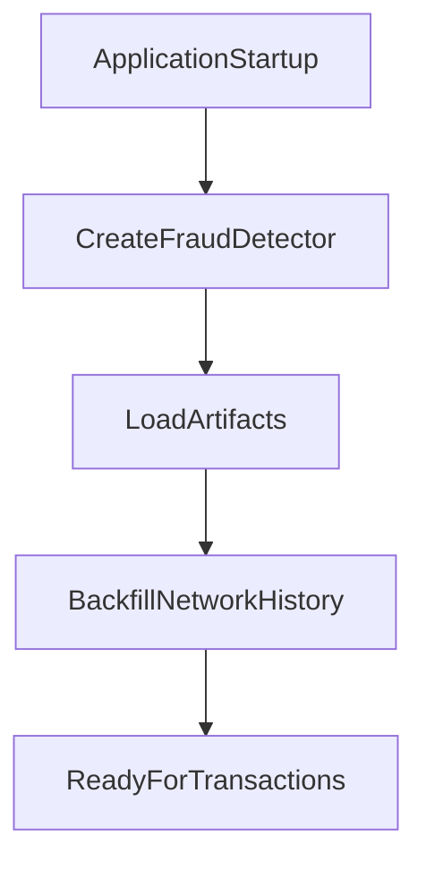
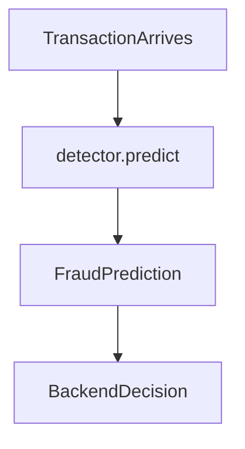

# Backend Integration

This repository exposes fraud detection through a direct Python class call. The backend repo owns HTTP, persistence, and orchestration.

## Quick start

```python
from src.fraud_detector import FraudDetector
from src.paysim_data import transaction_from_row

detector = FraudDetector()

# After startup, backfill recent transactions for network intelligence.
# detector.network_analyzer.backfill([...])

prediction = detector.predict(transaction)

print(prediction.risk_level)
print(prediction.risk_score)
print(prediction.is_fraud)
print(prediction.decision_reasons)
```

## Startup lifecycle



On startup:

1. Create one `FraudDetector` instance per worker/process.
2. Artifacts load automatically from `src/artifacts/`.
3. Backfill recent transactions into the network graph before live scoring.

## Transaction lifecycle



For each transaction:

1. Build a validated `TransactionInput`.
2. Call `detector.predict(transaction)`.
3. Use `FraudPrediction` fields for routing, review queues, and audit logs.

## Critical worker rule

Do **not** instantiate a new `FraudDetector` for every transaction.

Use one long-lived instance per worker/process. Creating a detector per request destroys process-local network history and produces inconsistent network scores.

## Input contract

`TransactionInput` requires:

| Field | Description |
|---|---|
| `transaction_id` | Stable unique ID for idempotent retries |
| `sender_id` | Origin account identifier |
| `receiver_id` | Destination account identifier |
| `timestamp` | Timezone-aware transaction time |
| `step` | PaySim-style hourly step (or equivalent time index) |
| `type` | `CASH_IN`, `CASH_OUT`, `DEBIT`, `PAYMENT`, or `TRANSFER` |
| `amount` | Transaction amount |
| `oldbalanceOrg` | Origin balance before transaction |
| `oldbalanceDest` | Destination balance before transaction |
| `orig_previous_*` | Origin account history features |
| `dest_previous_*` | Destination account history features |

Entity resolution uses exact account-ID matching. Fuzzy person/company resolution is not supported in the prototype. See [NETWORK_INTELLIGENCE.md](NETWORK_INTELLIGENCE.md).

## Output contract

`FraudPrediction` includes:

- `is_fraud`, `risk_score`, `risk_level` — final decision from the four-signal risk engine
- `fraud_probability` — raw XGBoost probability
- `signal_scores` — model, rule, anomaly, and network contributions
- `decision_reasons` — unified reasons supporting the final decision
- `reasons` — raw model SHAP-style contributions for audit
- `triggered_rules`, `anomaly`, `network` — full signal payloads

Use `decision_reasons` for investigator-facing explanations. Use `reasons` for model audit trails.

## Runtime requirements

- Process transactions chronologically within a worker.
- Retry the same `transaction_id` safely; network recording is idempotent.
- Backfill network history after every service restart.
- Ship all artifacts listed below with the deployment.

## Required artifacts

| Artifact | Purpose |
|---|---|
| `src/artifacts/fraud_model.json` | XGBoost supervised model |
| `src/artifacts/fraud_model_config.json` | Model metadata and preserved threshold |
| `src/artifacts/anomaly_model.joblib` | Isolation Forest anomaly model |
| `src/artifacts/risk_config.json` | Four-signal risk weights and thresholds |
| `src/artifacts/network_config.json` | Network indicator thresholds |

## Out of scope for this repo

- FastAPI or HTTP endpoints
- Shared graph database
- Fuzzy entity resolution
- Investigator UI
- Feedback loop and automated retraining
